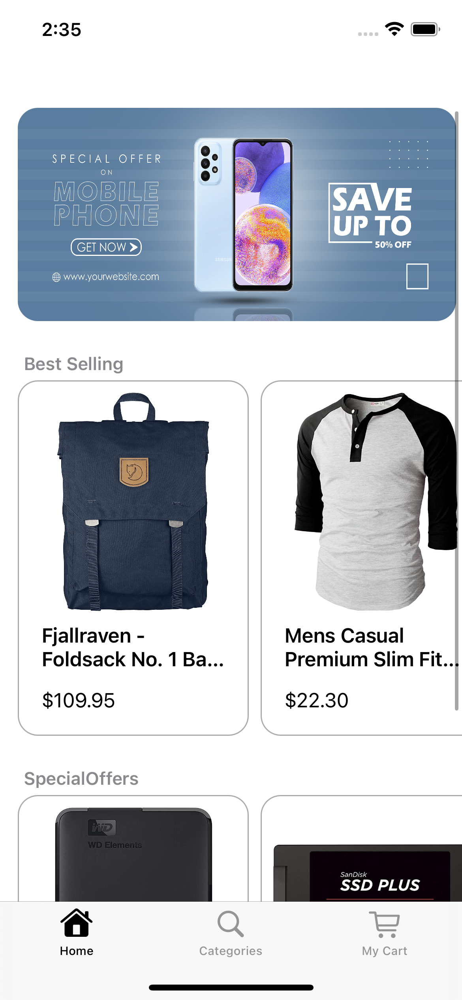
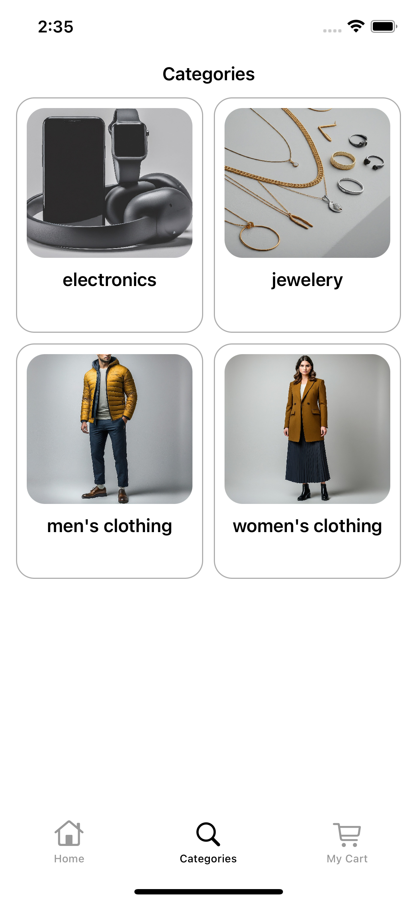
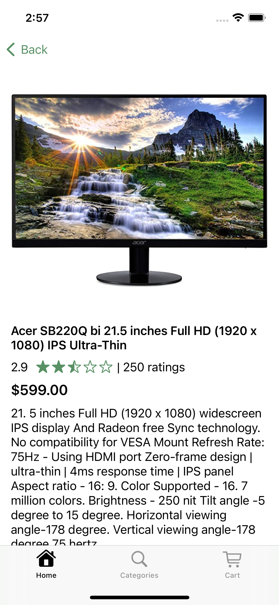
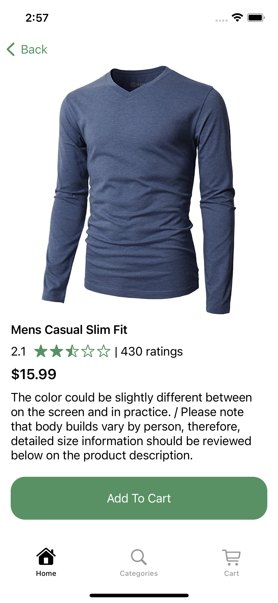
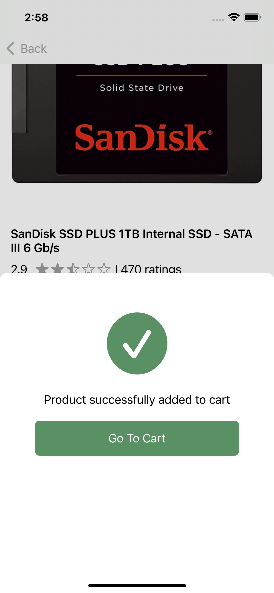
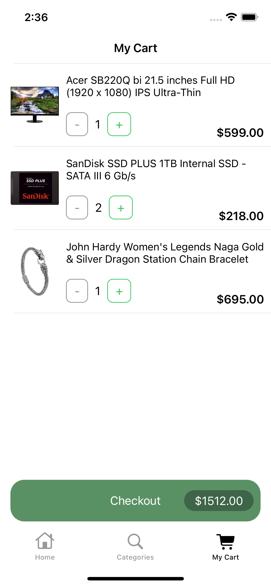
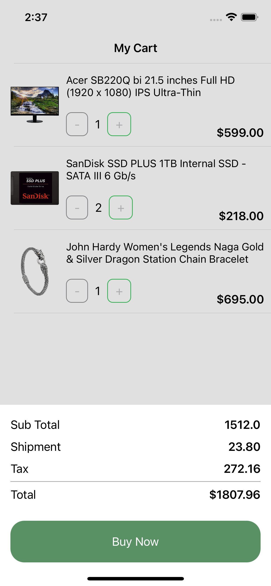
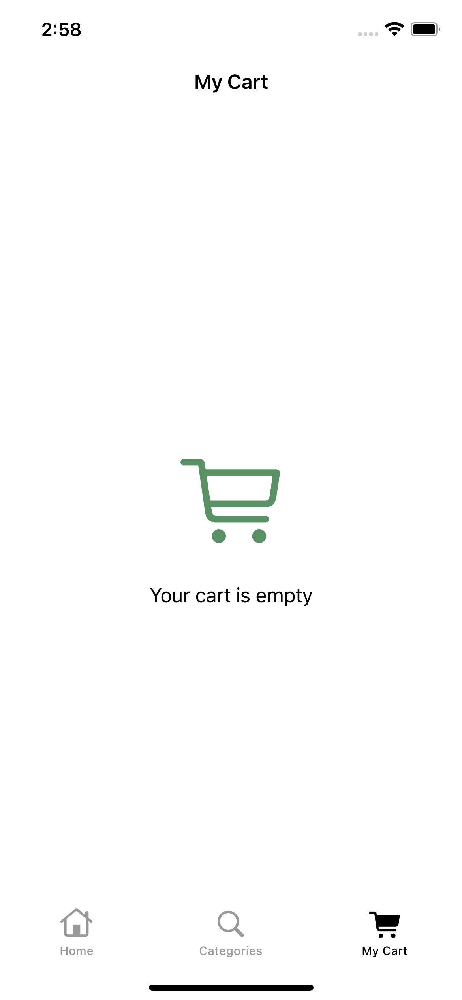

# Simple Shopping App

This is a simple shopping app built using the VIPER architecture in Swift. The app allows users to browse products, add them to a cart, and proceed to checkout.

Credit: Yiğithan Sönmez

## Features

- Browse Products: Users can browse through a list of products.
- Add to Cart: Users can add products to their cart.
- Checkout: Users can proceed to checkout and view the total cost of the items in their cart.

### Technologies and Libraries
- VIPER
- CoreData
- Alamofire
- Kingfisher
- Snapkit

## Screenshots

 
 
 
 

## VIPER Architecture

The app is built using the VIPER (View, Interactor, Presenter, Entity, Router) architecture. This architecture is designed to improve the separation of concerns in the app, making it more modular and easier to maintain and test.

- **View**: The View is responsible for displaying what the Presenter tells it to and capturing user input.
- **Interactor**: The Interactor contains the business logic.
- **Presenter**: The Presenter talks to the Interactor, View, and Router.
- **Entity**: The Entity represents the basic model objects used by the Interactor.
- **Router**: The Router handles navigation between screens.

## How to run

1. Clone this repository.
   ```sh
   git clone https://github.com/SonmezYigithan/ShoppingApp-iOS.git
   ```
2. Open the project in Xcode
3. Build and run the project on your simulator or device.
